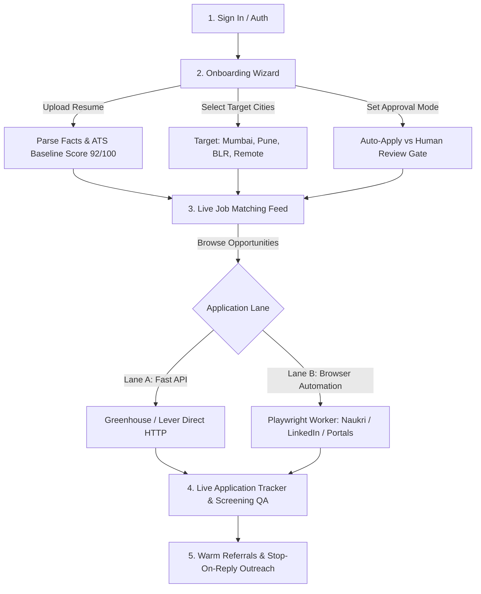

# Job Hunt Platform: Frontend System Design (FSD) v1.0

**Scope:** Complete frontend architecture, user experience journey, component hierarchy, state management, and the Dual-Lane (API vs. Playwright Browser) execution interface.  
**Counterpart to:** `job-hunt-platform-HLD-consolidated.md` and `job-hunt-platform-LLD-starter.md`.  
**Reference Target UI:** Consumer AI Job Agent SaaS aesthetic ([jobsapply.online](https://jobsapply.online/)) + Operator Engineering Console.

---

## Table of Contents

- [1. Executive Summary & Problem Diagnosis](#1-executive-summary--problem-diagnosis)
- [2. User Journey & Core Product Flow](#2-user-journey--core-product-flow)
- [3. Frontend Architecture & Technology Stack](#3-frontend-architecture--technology-stack)
- [4. Detailed Screen & Component Specifications](#4-detailed-screen--component-specifications)
  - [4.1 Screen 1: Auth & Session Management](#41-screen-1-auth--session-management)
  - [4.2 Screen 2: Candidate Onboarding Wizard](#42-screen-2-candidate-onboarding-wizard)
  - [4.3 Screen 3: Live Job Matches & Fit Discovery](#43-screen-3-live-job-matches--fit-discovery)
  - [4.4 Screen 4: Role-Tailored LaTeX & ATS Resume Sandbox](#44-screen-4-role-tailored-latex--ats-resume-sandbox)
  - [4.5 Screen 5: Dual-Lane Application Tracker & Playwright Inspector](#45-screen-5-dual-lane-application-tracker--playwright-inspector)
  - [4.6 Screen 6: Warm Referral Discovery & Outreach Sequences](#46-screen-6-warm-referral-discovery--outreach-sequences)
  - [4.7 Screen 7: Operator & Engineering Console](#47-screen-7-operator--engineering-console)
- [5. Dual-Lane Engine Architecture (API vs. Playwright)](#5-dual-lane-engine-architecture-api-vs-playwright)
- [6. Frontend State Management & API Contract](#6-frontend-state-management--api-contract)
- [7. Codebase Reorganization & De-jumbling Strategy](#7-codebase-reorganization--de-jumbling-strategy)
- [8. Step-by-Step Implementation Roadmap](#8-step-by-step-implementation-roadmap)

---

## 1. Executive Summary & Problem Diagnosis

### 1.1 Why the Codebase Felt "Jumbled"
The platform has a rock-solid, production-grade backend:
- 10 PostgreSQL schemas with relational integrity and transactional outbox.
- Deterministic 4-layer deduplication engine.
- 100% anti-hallucination document planner with modular LaTeX compiler.
- Rate-limiting, circuit breakers, and robots.txt politeness engines.
- Seeded verified Indian jobs across Mumbai, Pune, and Bengaluru.

**The friction occurred because:**
1. **Frontend-Backend Coupling:** The initial dashboard was built as an internal operator tool (`src/dashboard/public`) with raw database metrics (crawls, hashes, tables) rather than a clean, user-centric product journey.
2. **Missing Frontend State Machine:** Client code in `app.js` directly manipulated the DOM with loose asynchronous calls instead of structured screen controllers and reactive state stores.
3. **Execution Path Conflation:** Direct HTTP submissions (Greenhouse/Lever) and heavy browser automation (Playwright for Naukri/LinkedIn) were mixed directly into API endpoints instead of being decoupled via an asynchronous job dispatcher with real-time UI streaming.

### 1.2 Design Objectives
- **Consumer-Grade Polish:** Modern, accessible, responsive design system based on `jobsapply.online` (DM Sans typography, floating frosted pill header, dark accent bento cards, and interactive 5-step workspace).
- **Location-Targeted Experience:** Grounded in India's top tech hubs (**Mumbai**, **Pune**, **Bengaluru**, and **Remote India**).
- **Dual-Lane Transparency:** Total visibility when Playwright runs a headed/headless browser to fill forms, with answer review and human approval safeguards.

---

## 2. User Journey & Core Product Flow



---

## 3. Frontend Architecture & Technology Stack

### 3.1 Stack Decision
* **Core Runtime:** Fastify static serving with ultra-low latency, zero client build overhead.
* **Component Paradigm:** Modular Component Controllers (`src/dashboard/public/modules/`) with unidirectional state flow.
* **Typography:** `DM Sans` (display & headings), `Inter` (body & forms), `JetBrains Mono` (code/LaTeX).
* **Styling:** Modern CSS3 Design Tokens, CSS Grid Bento layouts, Glassmorphism (`backdrop-filter: blur(16px)`), SVG keyframe orbital animations.
* **Real-Time Updates:** Server-Sent Events (SSE) or Fastify WebSocket / Polling for Playwright browser execution logs and screenshots.

### 3.2 Directory Structure (Target Clean Architecture)

```
src/
├── api/                          # Fastify REST Backend (BFF)
│   ├── routes/
│   │   ├── candidates.ts         # Profile, facts, location preferences
│   │   ├── jobs.ts               # Jobs query, location filters, match ranking
│   │   ├── applications.ts       # Application dispatch & approval gate
│   │   ├── documents.ts          # LaTeX & ATS resume compilation
│   │   └── outreach.ts           # Referral contacts & email sequences
│   └── server.ts                 # Fastify server & static asset mount
│
├── workers/                      # Background Automation Engines
│   ├── queue.ts                  # In-memory / PgMQ application job queue
│   ├── api-dispatcher.ts         # Lane A: Direct HTTP (Greenhouse, Lever)
│   └── playwright-worker.ts      # Lane B: Playwright Headless/Headed Browser Runner
│
└── dashboard/                    # Frontend Client
    └── public/
        ├── index.html            # Semantic HTML shell (Hero, Bento, 5-Step Workspace)
        ├── styles.css            # Design system, bento grids, orbital animations
        ├── app.js                # Core app entry point & router
        └── modules/
            ├── state.js          # Reactive client store
            ├── onboarding.js     # Step 1: Resume dropzone & location selector
            ├── jobs-feed.js      # Step 2: Job cards, location chips & filter controls
            ├── resume-studio.js  # Step 3: LaTeX code editor & PDF preview
            ├── apply-tracker.js  # Step 4: Submission cards, screening answers & approval
            ├── referrals.js      # Step 5: Alumni discovery & cold email sequences
            └── console.js        # Operator Engine Drawer (metrics, outbox, spiders)
```

---

## 4. Detailed Screen & Component Specifications

### 4.1 Screen 1: Auth & Session Management
- **Floating Header Pill:**
  - Brand identity (`⚡ jobsapply`).
  - Navigation anchors (`Capabilities`, `Integrations`, `How It Works`, `Live Agent`, `Reviews`, `FAQ`).
  - Active candidate switcher dropdown (`Vikas Pal (Mumbai, India)`).
  - Mode Switcher: Switch between `⚡ Candidate App` and `🛠️ Engine Console`.
  - Primary CTA: `Start Free` / `Review Queue` pill with pending count badge.

### 4.2 Screen 2: Candidate Onboarding Wizard (Where User Provides Data)
- **Dropzone Area:** Interactive drag-and-drop for `resume.pdf`.
- **Real-Time Fact Extraction Display:**
  - Extracted skills badges (`Node.js`, `React`, `TypeScript`, `PostgreSQL`, `Docker`).
  - Experience years & roles detected.
  - Initial ATS baseline score dial (e.g. `92/100`).
- **Location Selector (Multi-Select Chips):**
  - `📍 Mumbai`
  - `📍 Pune`
  - `📍 Bengaluru`
  - `🌐 Remote (India)`
- **Execution Mode Radio:**
  - *Option 1 (Recommended):* **Human Review Gate** (Prepares applications and waits for your 1-click confirmation before submitting).
  - *Option 2:* **Autonomous Pilot** (Submits automatically when job fit score > 85%).

### 4.3 Screen 3: Live Job Matches & Fit Discovery
- **Controls Toolbar:**
  - Quick location chips: `All`, `📍 Mumbai`, `📍 Pune`, `📍 Bengaluru`, `🌐 Remote (India)`.
  - Toggle: `Live Verified Jobs Only` (filters out synthetic test data).
  - Real-time job counter badge (`11 verified jobs`).
- **Modern Job Card Structure:**
  - **Header:** Company name, role title, fit badge (`★ BEST 91%` or `Verified`).
  - **Location Pill:** City, state, workplace type (`Mumbai, India (Hybrid)`).
  - **Snippet:** Concise description of the opening.
  - **Action Footer:**
    - `Apply on Portal ↗` (opens genuine company careers link in safe new tab).
    - `Auto-Apply ⚡` (triggers the dual-lane application generator).

### 4.4 Screen 4: Role-Tailored LaTeX & ATS Resume Sandbox
- **Anti-Hallucination Split Pane:**
  - **Left Pane:** Code editor showing the tailored `resume.tex` strictly generated from verified candidate facts.
  - **Right Pane:** Live PDF artifact preview with 2-page budget confirmation badge (`2-Page Budget Verified ✓`) and `Download PDF` button.

### 4.5 Screen 5: Dual-Lane Application Tracker & Playwright Inspector
- **Application Status Timeline:**
  - Card per job application displaying:
    - Target company & position.
    - Lane indicator: `⚡ Direct API` vs. `🌐 Browser Worker (Playwright)`.
    - Lifecycle status: `PENDING_APPROVAL` | `IN_PROGRESS` | `SUBMITTED` | `REJECTED`.
- **Screening Q&A Inspector Drawer:**
  - View exact answers filled by the agent (e.g., *“Years of React experience? 4 years (From Fact Store)”*).
- **Approval Action Buttons:**
  - `Approve & Send` (triggers submission).
  - `Reject` (discards).

### 4.6 Screen 6: Warm Referral Discovery & Outreach Sequences
- **Referral Leads Grid:**
  - Cards identifying employees, alumni, and mutual connections inside target companies (e.g., Razorpay, PhonePe, BrowserStack).
  - Connection signal badge: `★ Alumni (Tech Mahindra)` | `✦ Same Location (Pune)` | `2nd-Degree Connection`.
  - 3-Step Outreach sequence preview:
    - Step 1: Initial personalized intro note.
    - Step 2: Value-add follow-up (+3 days).
    - Step 3: Polite closing (+5 days).
    - Safeguard: **Stop-on-reply listener** automatically halts the sequence when the recipient responds.

### 4.7 Screen 7: Operator & Engineering Console
- **Slide-Over Modal for System Operators:**
  - **Metric Counters:** Discovered Postings, Canonical Deduplicated, Matched Opportunities, Human Review Queue.
  - **Database Status:** Supabase connection health & outbox relay state.
  - **Spiders & Seed Trigger:** Button to run background discovery spiders or re-seed live Indian jobs.

---

## 5. Dual-Lane Engine Architecture (API vs. Playwright)

To keep the application modular and prevent browser automation from freezing the UI, we enforce a strict separation between Lane A and Lane B:

```
                            [ User Triggers Apply ]
                                       │
                                       ▼
                         POST /api/applications/dispatch
                                       │
                                       ▼
                       [ Lane Dispatcher Evaluates Domain ]
                                       │
              ┌────────────────────────┴────────────────────────┐
              ▼                                                 ▼
      【 Lane A: HTTP API 】                         【 Lane B: Playwright Browser 】
  Target: Greenhouse, Lever, Ashby             Target: Naukri, LinkedIn, Workday, Portals
  • Direct REST/JSON payload                   • Background Worker Process (`workers/`)
  • Sub-second response                        • Headless or Headed Chromium Instance
  • Returns confirmation immediately           • Navigates, uploads resume, fills QA
                                               • Emits progress events to UI:
                                                 - `LAUNCHING_BROWSER`
                                                 - `NAVIGATING_PORTAL`
                                                 - `FILLING_SCREENING_QUESTIONS`
                                                 - `SUBMITTED`
```

---

## 6. Frontend State Management & API Contract

### 6.1 State Store Structure (`modules/state.js`)
```typescript
interface FrontendState {
  candidate: {
    id: string;
    fullName: string;
    currentLocation: string;
    preferredLocations: string[];
    skills: string[];
    atsScore: number;
  };
  filters: {
    location: 'all' | 'mumbai' | 'pune' | 'bengaluru' | 'remote';
    realOnly: boolean;
    searchQuery: string;
  };
  jobs: JobCard[];
  applications: ApplicationItem[];
  outreach: OutreachMessage[];
  activeStep: 'profile' | 'jobs' | 'resume' | 'apply' | 'referrals';
  activeConsole: boolean;
}
```

### 6.2 REST BFF Endpoints
| Method | Endpoint | Description |
| :--- | :--- | :--- |
| `GET` | `/api/candidates` | Returns list of candidates with preferred locations |
| `PATCH` | `/api/candidates/:id/preferences` | Updates preferred cities & target roles |
| `GET` | `/api/candidates/:id/facts` | Returns candidate fact store (skills, experience) |
| `GET` | `/api/jobs` | Queries jobs with `?location=...&realOnly=true&candidateId=...` |
| `GET` | `/api/resumes` | Retrieves compiled LaTeX and PDF artifacts |
| `POST` | `/api/applications` | Prepares application & answers screening questions |
| `POST` | `/api/applications/:id/approve` | Approves and dispatches application to worker |
| `GET` | `/api/outreach/messages` | Lists warm referral outreach messages and statuses |
| `GET` | `/api/analytics/funnel` | Returns metrics for the Engineering Console |

---

## 7. Codebase Reorganization & De-jumbling Strategy

To transform the codebase from "jumbled scripts" into a clean, professional architecture:

1. **Keep Fastify Server Clean:** `src/api/server.ts` handles routing, static asset serving, and CORS. It does NOT launch browsers directly.
2. **Move Browser Automation to Dedicated Worker:** Place Playwright execution in `src/workers/playwright-worker.ts`. The API simply enqueues the task in `apply.applications`, and the worker consumes it.
3. **Modularize Dashboard Client:** Break `app.js` into focused, single-responsibility modules under `src/dashboard/public/modules/`.

---

## 8. Step-by-Step Implementation Roadmap

- [ ] **Phase 1: Architecture Documentation (Completed)**
  - Authored `frontend-system-design.md` establishing the complete system blueprint.
- [ ] **Phase 2: Modular Frontend Controllers**
  - Split `src/dashboard/public/app.js` into clean ESM modules (`state.js`, `onboarding.js`, `jobs-feed.js`, `apply-tracker.js`).
- [ ] **Phase 3: Candidate Onboarding & Preferences Form**
  - Connect the location selector (Mumbai, Pune, Bengaluru, Remote) and resume dropzone directly to `PATCH /api/candidates/:id/preferences`.
- [ ] **Phase 4: Dual-Lane Application Worker Implementation**
  - Build `src/workers/playwright-worker.ts` with clean separation between direct API and Playwright browser automation.
- [ ] **Phase 5: Real-Time Browser Logs & Progress Streaming**
  - Stream browser filling events to the UI so the user can watch Playwright fill screening questions safely.
- [ ] **Phase 6: Full Verification & Automated Regression**
  - Run the entire 19-file test suite (`npm test`) to guarantee 100% green status and zero regressions.
