# Community 2

> 59 nodes · cohesion 0.07

## Key Concepts

- [main()](file:///Users/apple/Desktop/myjobapply/scripts/demo.ts#L18) (25 connections)
- [emitOutboxEvent()](file:///Users/apple/Desktop/myjobapply/src/db/index.ts#L35) (16 connections)
- [ApplicationWorkflowEngine](file:///Users/apple/Desktop/myjobapply/src/apply/workflow.ts#L14) (10 connections)
- [db](file:///Users/apple/Desktop/myjobapply/src/apply/workflow.ts#L12) (9 connections)
- [EmailService](file:///Users/apple/Desktop/myjobapply/src/outreach/email-service.ts#L30) (8 connections)
- [.getApplication()](file:///Users/apple/Desktop/myjobapply/src/apply/workflow.ts#L512) (8 connections)
- [SchedulerService](file:///Users/apple/Desktop/myjobapply/src/orchestration/scheduler.ts#L10) (7 connections)
- [.completeTask()](file:///Users/apple/Desktop/myjobapply/src/orchestration/scheduler.ts#L121) (7 connections)
- [db](file:///Users/apple/Desktop/myjobapply/src/outreach/suppression.ts#L4) (7 connections)
- [.mapApplicationRow()](file:///Users/apple/Desktop/myjobapply/src/apply/workflow.ts#L547) (7 connections)
- [db](file:///Users/apple/Desktop/myjobapply/src/outreach/email-service.ts#L11) (6 connections)
- [.mapMessageRow()](file:///Users/apple/Desktop/myjobapply/src/outreach/email-service.ts#L420) (6 connections)
- [.sendOutreach()](file:///Users/apple/Desktop/myjobapply/src/outreach/email-service.ts#L220) (6 connections)
- [db](file:///Users/apple/Desktop/myjobapply/src/orchestration/scheduler.ts#L8) (6 connections)
- [.claimDueTask()](file:///Users/apple/Desktop/myjobapply/src/orchestration/scheduler.ts#L54) (6 connections)
- [.approveApplication()](file:///Users/apple/Desktop/myjobapply/src/apply/workflow.ts#L152) (6 connections)
- [.prepareApplication()](file:///Users/apple/Desktop/myjobapply/src/apply/workflow.ts#L81) (6 connections)
- [.runPoisonPillIsolationDrill()](file:///Users/apple/Desktop/myjobapply/src/resilience/chaos.ts#L90) (5 connections)
- [.draftOutreach()](file:///Users/apple/Desktop/myjobapply/src/outreach/email-service.ts#L41) (5 connections)
- [.recordBounce()](file:///Users/apple/Desktop/myjobapply/src/outreach/email-service.ts#L374) (5 connections)
- [PipelineOrchestrator](file:///Users/apple/Desktop/myjobapply/src/orchestration/pipeline.ts#L9) (5 connections)
- [.mapScheduleRow()](file:///Users/apple/Desktop/myjobapply/src/orchestration/scheduler.ts#L247) (5 connections)
- [.checkOutreachEligibility()](file:///Users/apple/Desktop/myjobapply/src/outreach/suppression.ts#L73) (5 connections)
- [.cancelApplication()](file:///Users/apple/Desktop/myjobapply/src/apply/workflow.ts#L243) (5 connections)
- [.createDraft()](file:///Users/apple/Desktop/myjobapply/src/apply/workflow.ts#L19) (5 connections)
- *... and 34 more nodes in this community*

## Class Diagram

```mermaid
classDiagram
    class AnswerMemoryService {
        +answer-memory.ts()
        +.saveAnswer()
        +.resolveAnswer()
        +.mapAnswerToOption()
    }
    class AutoFillService {
        +autofill.ts()
        +.fillForm()
    }
    class ChaosEngine {
        +chaos.ts()
        +.runWorkerCrashRecoveryDrill()
        +.runPoisonPillIsolationDrill()
        +.runIdempotencyBombardmentDrill()
    }
    class OutboxConsumer {
        +consumer.ts()
        +.constructor()
        +.subscribe()
        +.processBatch()
    }
    class EmailService {
        +email-service.ts()
        +.constructor()
        +.draftOutreach()
        +.approveOutreach()
        +.sendOutreach()
        +.recordReply()
        +.recordBounce()
        +.mapMessageRow()
    }
    class FormInspector {
        +form-inspector.ts()
        +.inspectForm()
        +.classifyField()
    }
    class PipelineOrchestrator {
        +pipeline.ts()
        +.constructor()
        +.getConsumer()
        +.registerPipelineHandlers()
        +.processPendingEvents()
    }
    class SchedulerService {
        +scheduler.ts()
        +.createSchedule()
        +.claimDueTask()
        +.completeTask()
        +.renewLease()
        +.getSchedule()
        +.mapScheduleRow()
    }
    class SuppressionService {
        +suppression.ts()
        +.isSuppressed()
        +.addSuppression()
        +.checkOutreachEligibility()
    }
    class ApplicationWorkflowEngine {
        +workflow.ts()
        +.createDraft()
        +.prepareApplication()
        +.approveApplication()
        +.pauseApplication()
        +.cancelApplication()
        +.executeApplicationRun()
        +.getApplication()
        +.getApplicationRuns()
        +.mapApplicationRow()
    }
```

## Relationships

- No strong cross-community connections detected

## Source Files

- [/Users/apple/Desktop/myjobapply/scripts/demo.ts](file:///Users/apple/Desktop/myjobapply/scripts/demo.ts)
- [/Users/apple/Desktop/myjobapply/src/apply/answer-memory.ts](file:///Users/apple/Desktop/myjobapply/src/apply/answer-memory.ts)
- [/Users/apple/Desktop/myjobapply/src/apply/autofill.ts](file:///Users/apple/Desktop/myjobapply/src/apply/autofill.ts)
- [/Users/apple/Desktop/myjobapply/src/apply/form-inspector.ts](file:///Users/apple/Desktop/myjobapply/src/apply/form-inspector.ts)
- [/Users/apple/Desktop/myjobapply/src/apply/workflow.ts](file:///Users/apple/Desktop/myjobapply/src/apply/workflow.ts)
- [/Users/apple/Desktop/myjobapply/src/db/index.ts](file:///Users/apple/Desktop/myjobapply/src/db/index.ts)
- [/Users/apple/Desktop/myjobapply/src/orchestration/consumer.ts](file:///Users/apple/Desktop/myjobapply/src/orchestration/consumer.ts)
- [/Users/apple/Desktop/myjobapply/src/orchestration/pipeline.ts](file:///Users/apple/Desktop/myjobapply/src/orchestration/pipeline.ts)
- [/Users/apple/Desktop/myjobapply/src/orchestration/scheduler.ts](file:///Users/apple/Desktop/myjobapply/src/orchestration/scheduler.ts)
- [/Users/apple/Desktop/myjobapply/src/outreach/email-service.ts](file:///Users/apple/Desktop/myjobapply/src/outreach/email-service.ts)
- [/Users/apple/Desktop/myjobapply/src/outreach/suppression.ts](file:///Users/apple/Desktop/myjobapply/src/outreach/suppression.ts)
- [/Users/apple/Desktop/myjobapply/src/resilience/chaos.ts](file:///Users/apple/Desktop/myjobapply/src/resilience/chaos.ts)

## Audit Trail

- EXTRACTED: 199 (70%)
- INFERRED: 87 (30%)
- AMBIGUOUS: 0 (0%)

---

*Part of the graphify knowledge wiki. See [[index]] to navigate.*