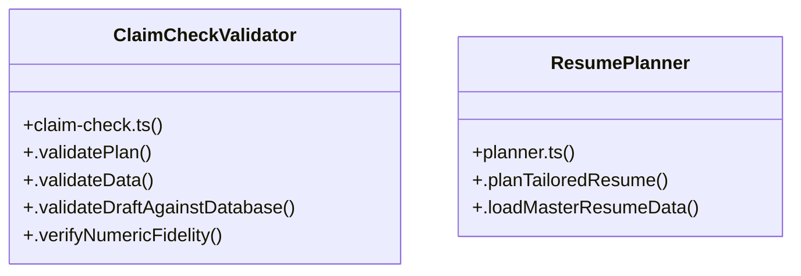

# Community 20

> 9 nodes · cohesion 0.36

## Key Concepts

- [.planTailoredResume()](file:///Users/apple/Desktop/myjobapply/src/docs/planner.ts#L25) (6 connections)
- [ClaimCheckValidator](file:///Users/apple/Desktop/myjobapply/src/docs/claim-check.ts#L11) (5 connections)
- [.validateData()](file:///Users/apple/Desktop/myjobapply/src/docs/claim-check.ts#L73) (4 connections)
- [.validateDraftAgainstDatabase()](file:///Users/apple/Desktop/myjobapply/src/docs/claim-check.ts#L235) (3 connections)
- [.validatePlan()](file:///Users/apple/Desktop/myjobapply/src/docs/claim-check.ts#L15) (3 connections)
- [ResumePlanner](file:///Users/apple/Desktop/myjobapply/src/docs/planner.ts#L21) (3 connections)
- [.verifyNumericFidelity()](file:///Users/apple/Desktop/myjobapply/src/docs/claim-check.ts#L263) (2 connections)
- [.createTailoredVersion()](file:///Users/apple/Desktop/myjobapply/src/docs/master.ts#L149) (2 connections)
- [.loadMasterResumeData()](file:///Users/apple/Desktop/myjobapply/src/docs/planner.ts#L252) (2 connections)

## Class Diagram

## Relationships

- No strong cross-community connections detected

## Source Files

- [/Users/apple/Desktop/myjobapply/src/docs/claim-check.ts](file:///Users/apple/Desktop/myjobapply/src/docs/claim-check.ts)
- [/Users/apple/Desktop/myjobapply/src/docs/master.ts](file:///Users/apple/Desktop/myjobapply/src/docs/master.ts)
- [/Users/apple/Desktop/myjobapply/src/docs/planner.ts](file:///Users/apple/Desktop/myjobapply/src/docs/planner.ts)

## Audit Trail

- EXTRACTED: 23 (77%)
- INFERRED: 7 (23%)
- AMBIGUOUS: 0 (0%)

---

*Part of the graphify knowledge wiki. See [[index]] to navigate.*