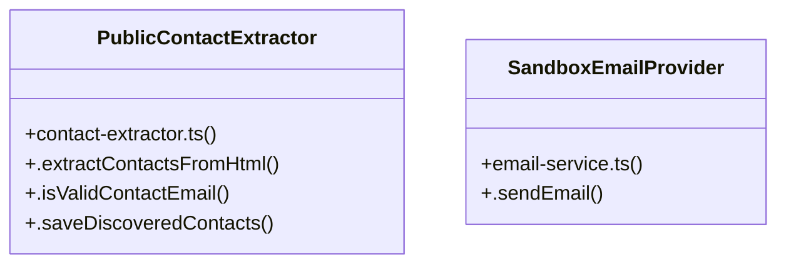

# Community 3

> 50 nodes · cohesion 0.05

## Key Concepts

- [outreach.test.ts](file:///Users/apple/Desktop/myjobapply/src/outreach/outreach.test.ts#L1) (38 connections)
- [contact-extractor.ts](file:///Users/apple/Desktop/myjobapply/src/outreach/contact-extractor.ts#L1) (8 connections)
- [email-service.ts](file:///Users/apple/Desktop/myjobapply/src/outreach/email-service.ts#L1) (8 connections)
- [outreach.ts](file:///Users/apple/Desktop/myjobapply/src/api/routes/outreach.ts#L1) (7 connections)
- [suppression.ts](file:///Users/apple/Desktop/myjobapply/src/outreach/suppression.ts#L1) (7 connections)
- [PublicContactExtractor](file:///Users/apple/Desktop/myjobapply/src/outreach/contact-extractor.ts#L22) (4 connections)
- [types.ts](file:///Users/apple/Desktop/myjobapply/src/outreach/types.ts#L1) (3 connections)
- [db](file:///Users/apple/Desktop/myjobapply/src/outreach/contact-extractor.ts#L5) (2 connections)
- [.extractContactsFromHtml()](file:///Users/apple/Desktop/myjobapply/src/outreach/contact-extractor.ts#L27) (2 connections)
- [.isValidContactEmail()](file:///Users/apple/Desktop/myjobapply/src/outreach/contact-extractor.ts#L80) (2 connections)
- [.saveDiscoveredContacts()](file:///Users/apple/Desktop/myjobapply/src/outreach/contact-extractor.ts#L99) (2 connections)
- [SandboxEmailProvider](file:///Users/apple/Desktop/myjobapply/src/outreach/email-service.ts#L14) (2 connections)
- [.sendEmail()](file:///Users/apple/Desktop/myjobapply/src/outreach/email-service.ts#L17) (2 connections)
- [contactExtractor](file:///Users/apple/Desktop/myjobapply/src/outreach/contact-extractor.ts#L154) (1 connections)
- [EXCLUDED_PREFIXES](file:///Users/apple/Desktop/myjobapply/src/outreach/contact-extractor.ts#L7) (1 connections)
- [db](file:///Users/apple/Desktop/myjobapply/src/api/routes/outreach.ts#L7) (1 connections)
- [outreachRoutes()](file:///Users/apple/Desktop/myjobapply/src/api/routes/outreach.ts#L9) (1 connections)
- [app](file:///Users/apple/Desktop/myjobapply/src/outreach/outreach.test.ts#L12) (1 connections)
- [approved](file:///Users/apple/Desktop/myjobapply/src/outreach/outreach.test.ts#L160) (1 connections)
- [approvedSend](file:///Users/apple/Desktop/myjobapply/src/outreach/outreach.test.ts#L230) (1 connections)
- [approveRes](file:///Users/apple/Desktop/myjobapply/src/outreach/outreach.test.ts#L222) (1 connections)
- [[candidate]](file:///Users/apple/Desktop/myjobapply/src/outreach/outreach.test.ts#L22) (1 connections)
- [[company]](file:///Users/apple/Desktop/myjobapply/src/outreach/outreach.test.ts#L42) (1 connections)
- [contacts](file:///Users/apple/Desktop/myjobapply/src/outreach/outreach.test.ts#L91) (1 connections)
- [[countRow]](file:///Users/apple/Desktop/myjobapply/src/outreach/outreach.test.ts#L105) (1 connections)
- *... and 25 more nodes in this community*

## Class Diagram

## Relationships

- No strong cross-community connections detected

## Source Files

- [/Users/apple/Desktop/myjobapply/src/api/routes/outreach.ts](file:///Users/apple/Desktop/myjobapply/src/api/routes/outreach.ts)
- [/Users/apple/Desktop/myjobapply/src/outreach/contact-extractor.ts](file:///Users/apple/Desktop/myjobapply/src/outreach/contact-extractor.ts)
- [/Users/apple/Desktop/myjobapply/src/outreach/email-service.ts](file:///Users/apple/Desktop/myjobapply/src/outreach/email-service.ts)
- [/Users/apple/Desktop/myjobapply/src/outreach/outreach.test.ts](file:///Users/apple/Desktop/myjobapply/src/outreach/outreach.test.ts)
- [/Users/apple/Desktop/myjobapply/src/outreach/suppression.ts](file:///Users/apple/Desktop/myjobapply/src/outreach/suppression.ts)
- [/Users/apple/Desktop/myjobapply/src/outreach/types.ts](file:///Users/apple/Desktop/myjobapply/src/outreach/types.ts)

## Audit Trail

- EXTRACTED: 124 (100%)
- INFERRED: 0 (0%)
- AMBIGUOUS: 0 (0%)

---

*Part of the graphify knowledge wiki. See [[index]] to navigate.*