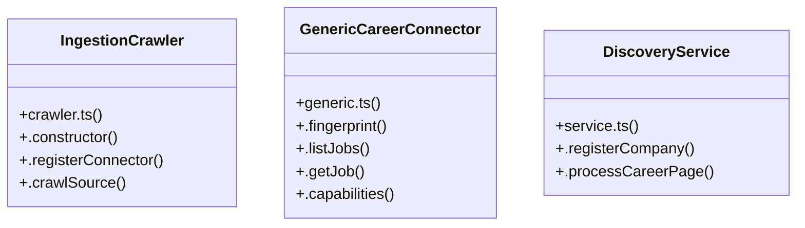

# Community 5

> 47 nodes · cohesion 0.05

## Key Concepts

- [crawler.test.ts](file:///Users/apple/Desktop/myjobapply/src/ingest/crawler.test.ts#L1) (15 connections)
- [fingerprint.test.ts](file:///Users/apple/Desktop/myjobapply/src/discovery/fingerprint.test.ts#L1) (13 connections)
- [pipeline.ts](file:///Users/apple/Desktop/myjobapply/src/api/routes/pipeline.ts#L1) (9 connections)
- [crawler.ts](file:///Users/apple/Desktop/myjobapply/src/ingest/crawler.ts#L1) (8 connections)
- [fingerprint.ts](file:///Users/apple/Desktop/myjobapply/src/discovery/fingerprint.ts#L1) (7 connections)
- [GenericCareerConnector](file:///Users/apple/Desktop/myjobapply/src/connectors/generic.ts#L18) (5 connections)
- [generic.ts](file:///Users/apple/Desktop/myjobapply/src/connectors/generic.ts#L1) (5 connections)
- [IngestionCrawler](file:///Users/apple/Desktop/myjobapply/src/ingest/crawler.ts#L19) (4 connections)
- [.crawlSource()](file:///Users/apple/Desktop/myjobapply/src/ingest/crawler.ts#L35) (4 connections)
- [types.ts](file:///Users/apple/Desktop/myjobapply/src/connectors/types.ts#L1) (4 connections)
- [classifyCareerPage()](file:///Users/apple/Desktop/myjobapply/src/discovery/fingerprint.ts#L69) (3 connections)
- [DiscoveryService](file:///Users/apple/Desktop/myjobapply/src/discovery/service.ts#L18) (3 connections)
- [.processCareerPage()](file:///Users/apple/Desktop/myjobapply/src/discovery/service.ts#L55) (3 connections)
- [.constructor()](file:///Users/apple/Desktop/myjobapply/src/ingest/crawler.ts#L22) (2 connections)
- [.registerConnector()](file:///Users/apple/Desktop/myjobapply/src/ingest/crawler.ts#L26) (2 connections)
- [.fingerprint()](file:///Users/apple/Desktop/myjobapply/src/connectors/generic.ts#L21) (2 connections)
- [.listJobs()](file:///Users/apple/Desktop/myjobapply/src/connectors/generic.ts#L26) (2 connections)
- [db](file:///Users/apple/Desktop/myjobapply/src/api/routes/pipeline.ts#L7) (2 connections)
- [company](file:///Users/apple/Desktop/myjobapply/src/ingest/crawler.test.ts#L17) (1 connections)
- [crawler](file:///Users/apple/Desktop/myjobapply/src/ingest/crawler.test.ts#L14) (1 connections)
- [discoveryService](file:///Users/apple/Desktop/myjobapply/src/ingest/crawler.test.ts#L13) (1 connections)
- [[jobSource]](file:///Users/apple/Desktop/myjobapply/src/ingest/crawler.test.ts#L28) (1 connections)
- [outboxAfterRun1](file:///Users/apple/Desktop/myjobapply/src/ingest/crawler.test.ts#L105) (1 connections)
- [outboxAfterRun2](file:///Users/apple/Desktop/myjobapply/src/ingest/crawler.test.ts#L124) (1 connections)
- [outboxAfterRun3](file:///Users/apple/Desktop/myjobapply/src/ingest/crawler.test.ts#L148) (1 connections)
- *... and 22 more nodes in this community*

## Class Diagram

## Relationships

- No strong cross-community connections detected

## Source Files

- [/Users/apple/Desktop/myjobapply/src/api/routes/pipeline.ts](file:///Users/apple/Desktop/myjobapply/src/api/routes/pipeline.ts)
- [/Users/apple/Desktop/myjobapply/src/connectors/generic.ts](file:///Users/apple/Desktop/myjobapply/src/connectors/generic.ts)
- [/Users/apple/Desktop/myjobapply/src/connectors/types.ts](file:///Users/apple/Desktop/myjobapply/src/connectors/types.ts)
- [/Users/apple/Desktop/myjobapply/src/discovery/fingerprint.test.ts](file:///Users/apple/Desktop/myjobapply/src/discovery/fingerprint.test.ts)
- [/Users/apple/Desktop/myjobapply/src/discovery/fingerprint.ts](file:///Users/apple/Desktop/myjobapply/src/discovery/fingerprint.ts)
- [/Users/apple/Desktop/myjobapply/src/discovery/service.ts](file:///Users/apple/Desktop/myjobapply/src/discovery/service.ts)
- [/Users/apple/Desktop/myjobapply/src/ingest/crawler.test.ts](file:///Users/apple/Desktop/myjobapply/src/ingest/crawler.test.ts)
- [/Users/apple/Desktop/myjobapply/src/ingest/crawler.ts](file:///Users/apple/Desktop/myjobapply/src/ingest/crawler.ts)

## Audit Trail

- EXTRACTED: 113 (93%)
- INFERRED: 9 (7%)
- AMBIGUOUS: 0 (0%)

---

*Part of the graphify knowledge wiki. See [[index]] to navigate.*