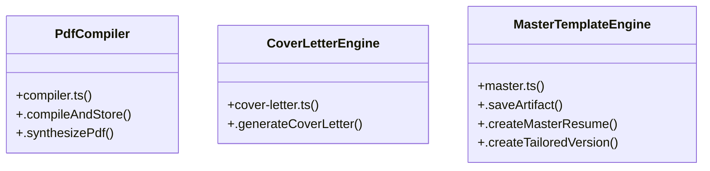

# Community 6

> 40 nodes · cohesion 0.06

## Key Concepts

- [compiler.test.ts](file:///Users/apple/Desktop/myjobapply/src/docs/compiler.test.ts#L1) (26 connections)
- [latex.ts](file:///Users/apple/Desktop/myjobapply/src/docs/latex.ts#L1) (7 connections)
- [.compileAndStore()](file:///Users/apple/Desktop/myjobapply/src/docs/compiler.ts#L27) (5 connections)
- [sql](file:///Users/apple/Desktop/myjobapply/src/db/index.ts#L6) (5 connections)
- [.generateCoverLetter()](file:///Users/apple/Desktop/myjobapply/src/docs/cover-letter.ts#L20) (4 connections)
- [MasterTemplateEngine](file:///Users/apple/Desktop/myjobapply/src/docs/master.ts#L5) (4 connections)
- [.createMasterResume()](file:///Users/apple/Desktop/myjobapply/src/docs/master.ts#L45) (4 connections)
- [.saveArtifact()](file:///Users/apple/Desktop/myjobapply/src/docs/master.ts#L9) (4 connections)
- [main()](file:///Users/apple/Desktop/myjobapply/scripts/seed-demo.ts#L138) (4 connections)
- [seed-demo.ts](file:///Users/apple/Desktop/myjobapply/scripts/seed-demo.ts#L1) (4 connections)
- [PdfCompiler](file:///Users/apple/Desktop/myjobapply/src/docs/compiler.ts#L20) (3 connections)
- [.synthesizePdf()](file:///Users/apple/Desktop/myjobapply/src/docs/compiler.ts#L81) (3 connections)
- [CoverLetterEngine](file:///Users/apple/Desktop/myjobapply/src/docs/cover-letter.ts#L15) (2 connections)
- [escapeLatex()](file:///Users/apple/Desktop/myjobapply/src/docs/latex.ts#L6) (2 connections)
- [renderLatexResume()](file:///Users/apple/Desktop/myjobapply/src/docs/latex.ts#L53) (2 connections)
- [sanitizeLatexSource()](file:///Users/apple/Desktop/myjobapply/src/docs/latex.ts#L26) (2 connections)
- [main()](file:///Users/apple/Desktop/myjobapply/scripts/migrate.ts#L5) (2 connections)
- [migrate.ts](file:///Users/apple/Desktop/myjobapply/scripts/migrate.ts#L1) (2 connections)
- [artifactId](file:///Users/apple/Desktop/myjobapply/src/docs/compiler.test.ts#L176) (1 connections)
- [[artifactRow]](file:///Users/apple/Desktop/myjobapply/src/docs/compiler.test.ts#L187) (1 connections)
- [benign](file:///Users/apple/Desktop/myjobapply/src/docs/compiler.test.ts#L37) (1 connections)
- [[candidate]](file:///Users/apple/Desktop/myjobapply/src/docs/compiler.test.ts#L123) (1 connections)
- [check1](file:///Users/apple/Desktop/myjobapply/src/docs/compiler.test.ts#L24) (1 connections)
- [check2](file:///Users/apple/Desktop/myjobapply/src/docs/compiler.test.ts#L29) (1 connections)
- [check3](file:///Users/apple/Desktop/myjobapply/src/docs/compiler.test.ts#L33) (1 connections)
- *... and 15 more nodes in this community*

## Class Diagram

## Relationships

- No strong cross-community connections detected

## Source Files

- [/Users/apple/Desktop/myjobapply/scripts/migrate.ts](file:///Users/apple/Desktop/myjobapply/scripts/migrate.ts)
- [/Users/apple/Desktop/myjobapply/scripts/seed-demo.ts](file:///Users/apple/Desktop/myjobapply/scripts/seed-demo.ts)
- [/Users/apple/Desktop/myjobapply/src/db/index.ts](file:///Users/apple/Desktop/myjobapply/src/db/index.ts)
- [/Users/apple/Desktop/myjobapply/src/docs/compiler.test.ts](file:///Users/apple/Desktop/myjobapply/src/docs/compiler.test.ts)
- [/Users/apple/Desktop/myjobapply/src/docs/compiler.ts](file:///Users/apple/Desktop/myjobapply/src/docs/compiler.ts)
- [/Users/apple/Desktop/myjobapply/src/docs/cover-letter.ts](file:///Users/apple/Desktop/myjobapply/src/docs/cover-letter.ts)
- [/Users/apple/Desktop/myjobapply/src/docs/latex.ts](file:///Users/apple/Desktop/myjobapply/src/docs/latex.ts)
- [/Users/apple/Desktop/myjobapply/src/docs/master.ts](file:///Users/apple/Desktop/myjobapply/src/docs/master.ts)

## Audit Trail

- EXTRACTED: 87 (81%)
- INFERRED: 20 (19%)
- AMBIGUOUS: 0 (0%)

---

*Part of the graphify knowledge wiki. See [[index]] to navigate.*