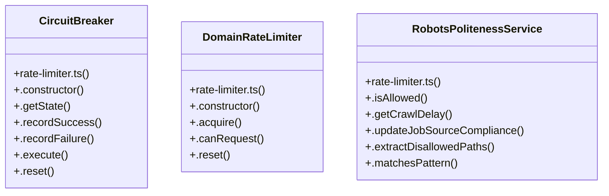

# Community 7

> 40 nodes · cohesion 0.06

## Key Concepts

- [rate-limiter.test.ts](file:///Users/apple/Desktop/myjobapply/src/orchestration/rate-limiter.test.ts#L1) (20 connections)
- [rate-limiter.ts](file:///Users/apple/Desktop/myjobapply/src/orchestration/rate-limiter.ts#L1) (8 connections)
- [CircuitBreaker](file:///Users/apple/Desktop/myjobapply/src/orchestration/rate-limiter.ts#L62) (7 connections)
- [RobotsPolitenessService](file:///Users/apple/Desktop/myjobapply/src/orchestration/rate-limiter.ts#L154) (6 connections)
- [.updateJobSourceCompliance()](file:///Users/apple/Desktop/myjobapply/src/orchestration/rate-limiter.ts#L187) (6 connections)
- [.execute()](file:///Users/apple/Desktop/myjobapply/src/orchestration/rate-limiter.ts#L124) (5 connections)
- [DomainRateLimiter](file:///Users/apple/Desktop/myjobapply/src/orchestration/rate-limiter.ts#L13) (5 connections)
- [.isAllowed()](file:///Users/apple/Desktop/myjobapply/src/orchestration/rate-limiter.ts#L158) (4 connections)
- [.getState()](file:///Users/apple/Desktop/myjobapply/src/orchestration/rate-limiter.ts#L80) (3 connections)
- [.extractDisallowedPaths()](file:///Users/apple/Desktop/myjobapply/src/orchestration/rate-limiter.ts#L224) (3 connections)
- [.recordFailure()](file:///Users/apple/Desktop/myjobapply/src/orchestration/rate-limiter.ts#L103) (2 connections)
- [.recordSuccess()](file:///Users/apple/Desktop/myjobapply/src/orchestration/rate-limiter.ts#L94) (2 connections)
- [db](file:///Users/apple/Desktop/myjobapply/src/orchestration/rate-limiter.ts#L8) (2 connections)
- [.acquire()](file:///Users/apple/Desktop/myjobapply/src/orchestration/rate-limiter.ts#L24) (2 connections)
- [.getCrawlDelay()](file:///Users/apple/Desktop/myjobapply/src/orchestration/rate-limiter.ts#L171) (2 connections)
- [.matchesPattern()](file:///Users/apple/Desktop/myjobapply/src/orchestration/rate-limiter.ts#L246) (2 connections)
- [types.ts](file:///Users/apple/Desktop/myjobapply/src/orchestration/types.ts#L1) (2 connections)
- [.constructor()](file:///Users/apple/Desktop/myjobapply/src/orchestration/rate-limiter.ts#L75) (1 connections)
- [.reset()](file:///Users/apple/Desktop/myjobapply/src/orchestration/rate-limiter.ts#L142) (1 connections)
- [.canRequest()](file:///Users/apple/Desktop/myjobapply/src/orchestration/rate-limiter.ts#L41) (1 connections)
- [.constructor()](file:///Users/apple/Desktop/myjobapply/src/orchestration/rate-limiter.ts#L17) (1 connections)
- [.reset()](file:///Users/apple/Desktop/myjobapply/src/orchestration/rate-limiter.ts#L50) (1 connections)
- [breaker](file:///Users/apple/Desktop/myjobapply/src/orchestration/rate-limiter.test.ts#L50) (1 connections)
- [[company]](file:///Users/apple/Desktop/myjobapply/src/orchestration/rate-limiter.test.ts#L16) (1 connections)
- [compliance](file:///Users/apple/Desktop/myjobapply/src/orchestration/rate-limiter.test.ts#L120) (1 connections)
- *... and 15 more nodes in this community*

## Class Diagram

## Relationships

- No strong cross-community connections detected

## Source Files

- [/Users/apple/Desktop/myjobapply/src/orchestration/rate-limiter.test.ts](file:///Users/apple/Desktop/myjobapply/src/orchestration/rate-limiter.test.ts)
- [/Users/apple/Desktop/myjobapply/src/orchestration/rate-limiter.ts](file:///Users/apple/Desktop/myjobapply/src/orchestration/rate-limiter.ts)
- [/Users/apple/Desktop/myjobapply/src/orchestration/types.ts](file:///Users/apple/Desktop/myjobapply/src/orchestration/types.ts)

## Audit Trail

- EXTRACTED: 100 (96%)
- INFERRED: 4 (4%)
- AMBIGUOUS: 0 (0%)

---

*Part of the graphify knowledge wiki. See [[index]] to navigate.*