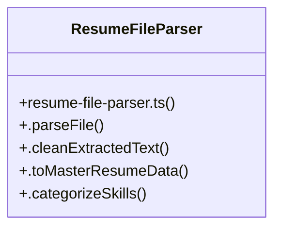

# Community 8

> 38 nodes · cohesion 0.08

## Key Concepts

- [resume-parser.ts](file:///Users/apple/Desktop/myjobapply/src/docs/resume-parser.ts#L1) (18 connections)
- [parseResume()](file:///Users/apple/Desktop/myjobapply/src/docs/resume-parser.ts#L100) (13 connections)
- [server.ts](file:///Users/apple/Desktop/myjobapply/src/api/server.ts#L1) (13 connections)
- [documents.ts](file:///Users/apple/Desktop/myjobapply/src/api/routes/documents.ts#L1) (6 connections)
- [ResumeFileParser](file:///Users/apple/Desktop/myjobapply/src/docs/resume-file-parser.ts#L13) (5 connections)
- [candidates.ts](file:///Users/apple/Desktop/myjobapply/src/api/routes/candidates.ts#L1) (5 connections)
- [analytics.ts](file:///Users/apple/Desktop/myjobapply/src/api/routes/analytics.ts#L1) (4 connections)
- [.parseFile()](file:///Users/apple/Desktop/myjobapply/src/docs/resume-file-parser.ts#L17) (3 connections)
- [extractExperience()](file:///Users/apple/Desktop/myjobapply/src/docs/resume-parser.ts#L332) (3 connections)
- [extractProjects()](file:///Users/apple/Desktop/myjobapply/src/docs/resume-parser.ts#L416) (3 connections)
- [extractSkills()](file:///Users/apple/Desktop/myjobapply/src/docs/resume-parser.ts#L289) (3 connections)
- [auth.ts](file:///Users/apple/Desktop/myjobapply/src/api/routes/auth.ts#L1) (3 connections)
- [resume-file-parser.ts](file:///Users/apple/Desktop/myjobapply/src/docs/resume-file-parser.ts#L1) (3 connections)
- [.categorizeSkills()](file:///Users/apple/Desktop/myjobapply/src/docs/resume-file-parser.ts#L139) (2 connections)
- [.cleanExtractedText()](file:///Users/apple/Desktop/myjobapply/src/docs/resume-file-parser.ts#L56) (2 connections)
- [.toMasterResumeData()](file:///Users/apple/Desktop/myjobapply/src/docs/resume-file-parser.ts#L75) (2 connections)
- [calculateAtsScore()](file:///Users/apple/Desktop/myjobapply/src/docs/resume-parser.ts#L583) (2 connections)
- [calculateTotalExperience()](file:///Users/apple/Desktop/myjobapply/src/docs/resume-parser.ts#L523) (2 connections)
- [cleanBulletText()](file:///Users/apple/Desktop/myjobapply/src/docs/resume-parser.ts#L602) (2 connections)
- [createEmptyParsedResume()](file:///Users/apple/Desktop/myjobapply/src/docs/resume-parser.ts#L643) (2 connections)
- [determineRoleTitle()](file:///Users/apple/Desktop/myjobapply/src/docs/resume-parser.ts#L557) (2 connections)
- [extractContactInfo()](file:///Users/apple/Desktop/myjobapply/src/docs/resume-parser.ts#L232) (2 connections)
- [extractEducation()](file:///Users/apple/Desktop/myjobapply/src/docs/resume-parser.ts#L468) (2 connections)
- [extractSummary()](file:///Users/apple/Desktop/myjobapply/src/docs/resume-parser.ts#L508) (2 connections)
- [formatSkillCasing()](file:///Users/apple/Desktop/myjobapply/src/docs/resume-parser.ts#L606) (2 connections)
- *... and 13 more nodes in this community*

## Class Diagram

## Relationships

- No strong cross-community connections detected

## Source Files

- [/Users/apple/Desktop/myjobapply/src/api/routes/analytics.ts](file:///Users/apple/Desktop/myjobapply/src/api/routes/analytics.ts)
- [/Users/apple/Desktop/myjobapply/src/api/routes/auth.ts](file:///Users/apple/Desktop/myjobapply/src/api/routes/auth.ts)
- [/Users/apple/Desktop/myjobapply/src/api/routes/candidates.ts](file:///Users/apple/Desktop/myjobapply/src/api/routes/candidates.ts)
- [/Users/apple/Desktop/myjobapply/src/api/routes/documents.ts](file:///Users/apple/Desktop/myjobapply/src/api/routes/documents.ts)
- [/Users/apple/Desktop/myjobapply/src/api/server.ts](file:///Users/apple/Desktop/myjobapply/src/api/server.ts)
- [/Users/apple/Desktop/myjobapply/src/docs/resume-file-parser.ts](file:///Users/apple/Desktop/myjobapply/src/docs/resume-file-parser.ts)
- [/Users/apple/Desktop/myjobapply/src/docs/resume-parser.ts](file:///Users/apple/Desktop/myjobapply/src/docs/resume-parser.ts)

## Audit Trail

- EXTRACTED: 121 (98%)
- INFERRED: 2 (2%)
- AMBIGUOUS: 0 (0%)

---

*Part of the graphify knowledge wiki. See [[index]] to navigate.*