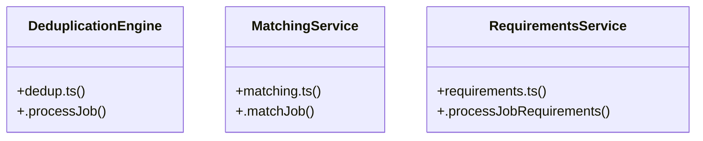

# Community 9

> 34 nodes · cohesion 0.07

## Key Concepts

- [dedup.test.ts](file:///Users/apple/Desktop/myjobapply/src/jobs/dedup.test.ts#L1) (19 connections)
- [normalizer.ts](file:///Users/apple/Desktop/myjobapply/src/jobs/normalizer.ts#L1) (8 connections)
- [seedIndianTechJobs()](file:///Users/apple/Desktop/myjobapply/src/connectors/india-tech-seed.ts#L155) (7 connections)
- [normalizeJob()](file:///Users/apple/Desktop/myjobapply/src/jobs/normalizer.ts#L151) (6 connections)
- [main()](file:///Users/apple/Desktop/myjobapply/src/scripts/seed-real-jobs.ts#L246) (6 connections)
- [.processJob()](file:///Users/apple/Desktop/myjobapply/src/jobs/dedup.ts#L28) (5 connections)
- [.matchJob()](file:///Users/apple/Desktop/myjobapply/src/jobs/matching.ts#L148) (5 connections)
- [.processJobRequirements()](file:///Users/apple/Desktop/myjobapply/src/jobs/requirements.ts#L151) (5 connections)
- [.registerCompany()](file:///Users/apple/Desktop/myjobapply/src/discovery/service.ts#L22) (4 connections)
- [extractStructuredLocation()](file:///Users/apple/Desktop/myjobapply/src/jobs/normalizer.ts#L71) (3 connections)
- [DeduplicationEngine](file:///Users/apple/Desktop/myjobapply/src/jobs/dedup.ts#L23) (2 connections)
- [evaluateCandidateFit()](file:///Users/apple/Desktop/myjobapply/src/jobs/matching.ts#L33) (2 connections)
- [MatchingService](file:///Users/apple/Desktop/myjobapply/src/jobs/matching.ts#L143) (2 connections)
- [cleanHtmlText()](file:///Users/apple/Desktop/myjobapply/src/jobs/normalizer.ts#L21) (2 connections)
- [extractRoleFamily()](file:///Users/apple/Desktop/myjobapply/src/jobs/normalizer.ts#L45) (2 connections)
- [extractSeniority()](file:///Users/apple/Desktop/myjobapply/src/jobs/normalizer.ts#L34) (2 connections)
- [extractWorkplaceType()](file:///Users/apple/Desktop/myjobapply/src/jobs/normalizer.ts#L59) (2 connections)
- [extractRequirementsFromText()](file:///Users/apple/Desktop/myjobapply/src/jobs/requirements.ts#L28) (2 connections)
- [RequirementsService](file:///Users/apple/Desktop/myjobapply/src/jobs/requirements.ts#L147) (2 connections)
- [canonicalJobId](file:///Users/apple/Desktop/myjobapply/src/jobs/dedup.test.ts#L76) (1 connections)
- [company](file:///Users/apple/Desktop/myjobapply/src/jobs/dedup.test.ts#L38) (1 connections)
- [dedupEngine](file:///Users/apple/Desktop/myjobapply/src/jobs/dedup.test.ts#L35) (1 connections)
- [discoveryService](file:///Users/apple/Desktop/myjobapply/src/jobs/dedup.test.ts#L34) (1 connections)
- [links](file:///Users/apple/Desktop/myjobapply/src/jobs/dedup.test.ts#L133) (1 connections)
- [norm](file:///Users/apple/Desktop/myjobapply/src/jobs/dedup.test.ts#L16) (1 connections)
- *... and 9 more nodes in this community*

## Class Diagram

## Relationships

- No strong cross-community connections detected

## Source Files

- [/Users/apple/Desktop/myjobapply/src/connectors/india-tech-seed.ts](file:///Users/apple/Desktop/myjobapply/src/connectors/india-tech-seed.ts)
- [/Users/apple/Desktop/myjobapply/src/discovery/service.ts](file:///Users/apple/Desktop/myjobapply/src/discovery/service.ts)
- [/Users/apple/Desktop/myjobapply/src/jobs/dedup.test.ts](file:///Users/apple/Desktop/myjobapply/src/jobs/dedup.test.ts)
- [/Users/apple/Desktop/myjobapply/src/jobs/dedup.ts](file:///Users/apple/Desktop/myjobapply/src/jobs/dedup.ts)
- [/Users/apple/Desktop/myjobapply/src/jobs/matching.ts](file:///Users/apple/Desktop/myjobapply/src/jobs/matching.ts)
- [/Users/apple/Desktop/myjobapply/src/jobs/normalizer.ts](file:///Users/apple/Desktop/myjobapply/src/jobs/normalizer.ts)
- [/Users/apple/Desktop/myjobapply/src/jobs/requirements.ts](file:///Users/apple/Desktop/myjobapply/src/jobs/requirements.ts)
- [/Users/apple/Desktop/myjobapply/src/scripts/seed-real-jobs.ts](file:///Users/apple/Desktop/myjobapply/src/scripts/seed-real-jobs.ts)

## Audit Trail

- EXTRACTED: 76 (75%)
- INFERRED: 25 (25%)
- AMBIGUOUS: 0 (0%)

---

*Part of the graphify knowledge wiki. See [[index]] to navigate.*