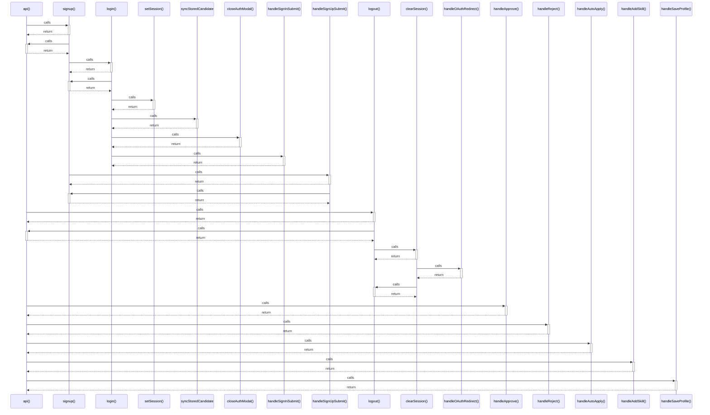

# api()

> God node · 8 connections · [/Users/apple/Desktop/myjobapply/frontend/src/api/client.ts](file:///Users/apple/Desktop/myjobapply/frontend/src/api/client.ts#L6)

## Call Trace Diagram

## Connections by Relation

### calls
- [[signup()]] `INFERRED`
- [[logout()]] `INFERRED`
- [[handleApprove()]] `INFERRED`
- [[handleReject()]] `INFERRED`
- [[handleAutoApply()]] `INFERRED`
- [[handleAddSkill()]] `INFERRED`
- [[handleSaveProfile()]] `INFERRED`

### contains
- [[client.ts]] `EXTRACTED`

---

*Part of the graphify knowledge wiki. See [[index]] to navigate.*