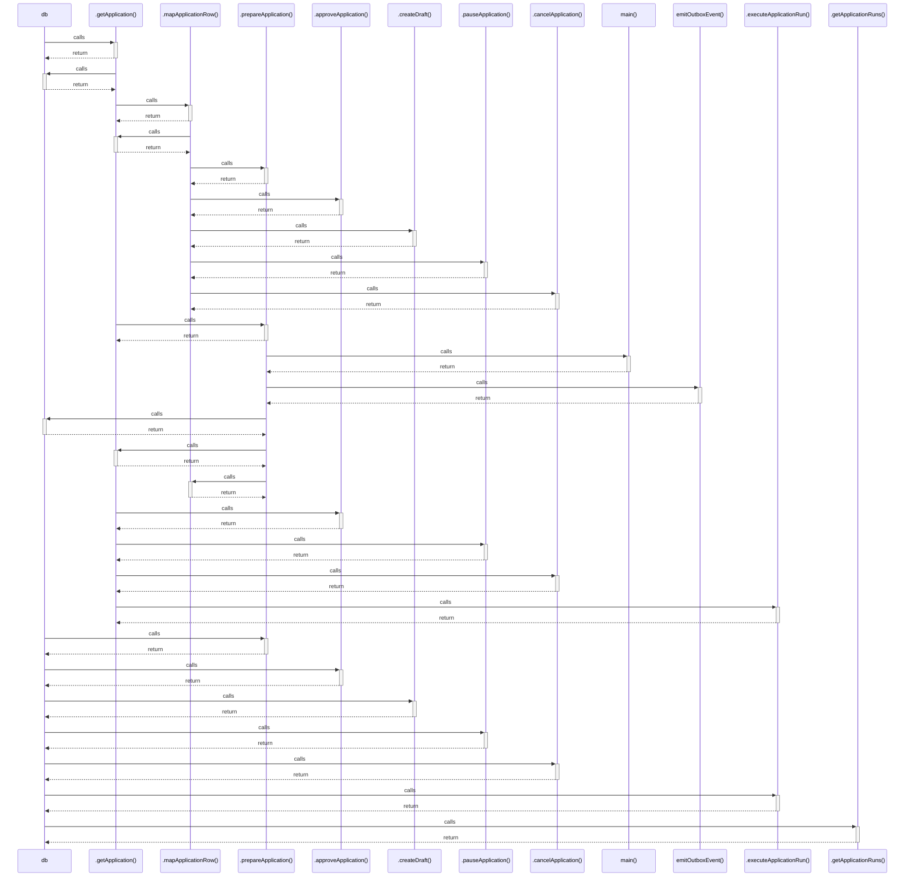

# db

> God node · 9 connections · [/Users/apple/Desktop/myjobapply/src/apply/workflow.ts](file:///Users/apple/Desktop/myjobapply/src/apply/workflow.ts#L12)

## Call Trace Diagram

## Connections by Relation

### calls
- [[.getApplication()]] `EXTRACTED`
- [[.prepareApplication()]] `EXTRACTED`
- [[.approveApplication()]] `EXTRACTED`
- [[.createDraft()]] `EXTRACTED`
- [[.pauseApplication()]] `EXTRACTED`
- [[.cancelApplication()]] `EXTRACTED`
- [[.executeApplicationRun()]] `EXTRACTED`
- [[.getApplicationRuns()]] `EXTRACTED`

### contains
- [[workflow.ts]] `EXTRACTED`

---

*Part of the graphify knowledge wiki. See [[index]] to navigate.*