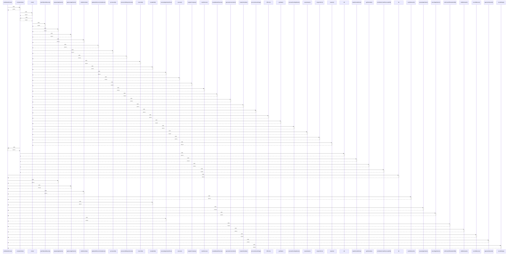

# emitOutboxEvent()

> God node · 16 connections · [/Users/apple/Desktop/myjobapply/src/db/index.ts](file:///Users/apple/Desktop/myjobapply/src/db/index.ts#L35)

## Call Trace Diagram

## Connections by Relation

### calls
- [[.completeTask()]] `INFERRED`
- [[db]] `INFERRED`
- [[.prepareApplication()]] `INFERRED`
- [[.approveApplication()]] `INFERRED`
- [[.claimDueTask()]] `INFERRED`
- [[.sendOutreach()]] `INFERRED`
- [[.createDraft()]] `INFERRED`
- [[.pauseApplication()]] `INFERRED`
- [[.cancelApplication()]] `INFERRED`
- [[.executeApplicationRun()]] `INFERRED`
- [[.runPoisonPillIsolationDrill()]] `INFERRED`
- [[.draftOutreach()]] `INFERRED`
- [[.recordBounce()]] `INFERRED`
- [[.approveOutreach()]] `INFERRED`
- [[.recordReply()]] `INFERRED`

### contains
- [[index.ts]] `EXTRACTED`

---

*Part of the graphify knowledge wiki. See [[index]] to navigate.*