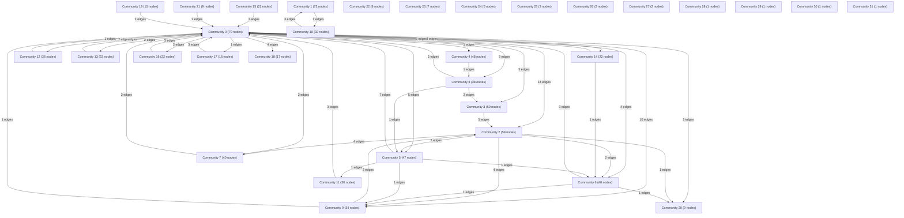

# Knowledge Graph Index

> Auto-generated by graphify. Start here — read community articles for context, then drill into god nodes for detail.

**783 nodes · 1118 edges · 32 communities**

---

## System Architecture Flowchart

## Communities
(sorted by size, largest first)

- [[Community 0]] — 79 nodes
- [[Community 1]] — 72 nodes
- [[Community 2]] — 59 nodes
- [[Community 3]] — 50 nodes
- [[Community 4]] — 48 nodes
- [[Community 5]] — 47 nodes
- [[Community 6]] — 40 nodes
- [[Community 7]] — 40 nodes
- [[Community 8]] — 38 nodes
- [[Community 9]] — 34 nodes
- [[Community 10]] — 32 nodes
- [[Community 11]] — 30 nodes
- [[Community 12]] — 26 nodes
- [[Community 13]] — 23 nodes
- [[Community 14]] — 22 nodes
- [[Community 15]] — 22 nodes
- [[Community 16]] — 22 nodes
- [[Community 17]] — 18 nodes
- [[Community 18]] — 17 nodes
- [[Community 19]] — 15 nodes
- [[Community 20]] — 9 nodes
- [[Community 21]] — 9 nodes
- [[Community 22]] — 8 nodes
- [[Community 23]] — 7 nodes
- [[Community 24]] — 5 nodes
- [[Community 25]] — 3 nodes
- [[Community 26]] — 2 nodes
- [[Community 27]] — 2 nodes
- [[Community 28]] — 1 nodes
- [[Community 29]] — 1 nodes
- [[Community 30]] — 1 nodes
- [[Community 31]] — 1 nodes

## God Nodes
(most connected concepts — the load-bearing abstractions)

- [[main()]] — 25 connections
- [[emitOutboxEvent()]] — 16 connections
- [[parseResume()]] — 13 connections
- [[ApplicationWorkflowEngine]] — 10 connections
- [[db]] — 9 connections
- [[api()]] — 8 connections
- [[EmailService]] — 8 connections
- [[seedIndianTechJobs()]] — 7 connections
- [[SchedulerService]] — 7 connections
- [[CircuitBreaker]] — 7 connections

---

*Generated by [graphify](https://github.com/safishamsi/graphify)*