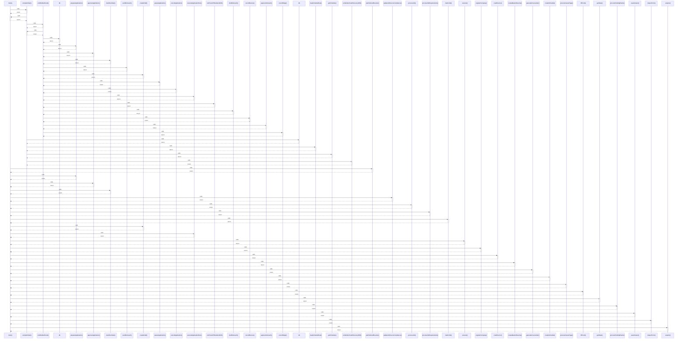

# main()

> God node · 25 connections · [/Users/apple/Desktop/myjobapply/scripts/demo.ts](file:///Users/apple/Desktop/myjobapply/scripts/demo.ts#L18)

## Call Trace Diagram

## Connections by Relation

### calls
- [[.completeTask()]] `INFERRED`
- [[.planTailoredResume()]] `INFERRED`
- [[.prepareApplication()]] `INFERRED`
- [[.approveApplication()]] `INFERRED`
- [[.claimDueTask()]] `INFERRED`
- [[.updateJobSourceCompliance()]] `INFERRED`
- [[.processJob()]] `INFERRED`
- [[.processJobRequirements()]] `INFERRED`
- [[.matchJob()]] `INFERRED`
- [[.createDraft()]] `INFERRED`
- [[.executeApplicationRun()]] `INFERRED`
- [[.execute()]] `INFERRED`
- [[.registerCompany()]] `INFERRED`
- [[.crawlSource()]] `INFERRED`
- [[.createMasterResume()]] `INFERRED`
- [[.generateCoverLetter()]] `INFERRED`
- [[.createSchedule()]] `INFERRED`
- [[.processCareerPage()]] `INFERRED`
- [[.fillForm()]] `INFERRED`
- [[.getState()]] `INFERRED`

### contains
- [[demo.ts]] `EXTRACTED`

---

*Part of the graphify knowledge wiki. See [[index]] to navigate.*