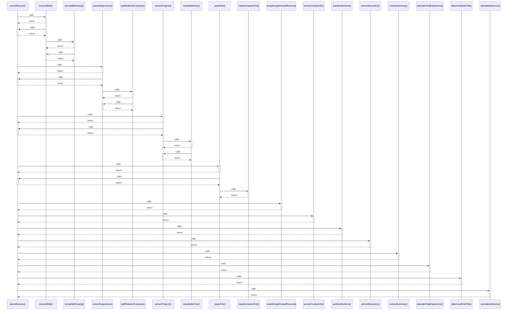

# parseResume()

> God node · 13 connections · [/Users/apple/Desktop/myjobapply/src/docs/resume-parser.ts](file:///Users/apple/Desktop/myjobapply/src/docs/resume-parser.ts#L100)

## Call Trace Diagram

## Connections by Relation

### calls
- [[extractSkills()]] `EXTRACTED`
- [[extractExperience()]] `EXTRACTED`
- [[extractProjects()]] `EXTRACTED`
- [[.parseFile()]] `INFERRED`
- [[createEmptyParsedResume()]] `EXTRACTED`
- [[extractContactInfo()]] `EXTRACTED`
- [[partitionSections()]] `EXTRACTED`
- [[extractEducation()]] `EXTRACTED`
- [[extractSummary()]] `EXTRACTED`
- [[calculateTotalExperience()]] `EXTRACTED`
- [[determineRoleTitle()]] `EXTRACTED`
- [[calculateAtsScore()]] `EXTRACTED`

### contains
- [[resume-parser.ts]] `EXTRACTED`

---

*Part of the graphify knowledge wiki. See [[index]] to navigate.*