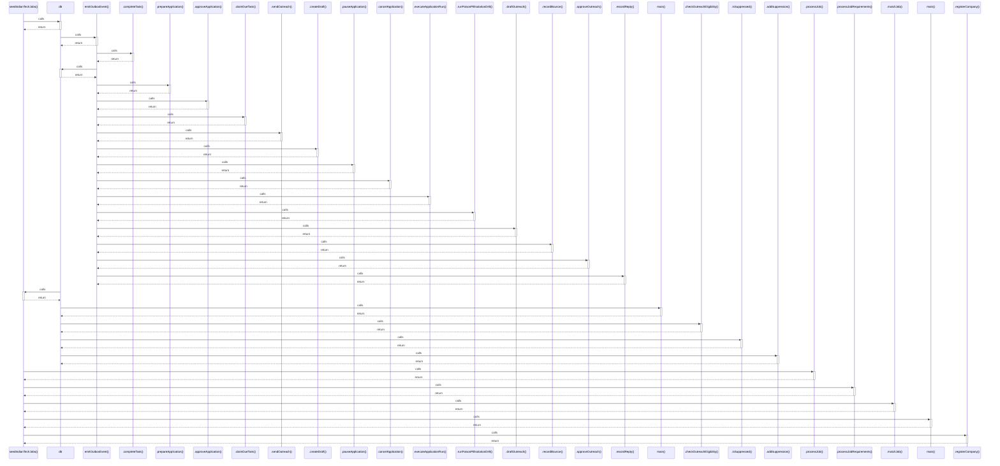

# seedIndianTechJobs()

> God node · 7 connections · [/Users/apple/Desktop/myjobapply/src/connectors/india-tech-seed.ts](file:///Users/apple/Desktop/myjobapply/src/connectors/india-tech-seed.ts#L155)

## Call Trace Diagram

## Connections by Relation

### calls
- [[db]] `INFERRED`
- [[.processJob()]] `INFERRED`
- [[.processJobRequirements()]] `INFERRED`
- [[.matchJob()]] `INFERRED`
- [[main()]] `INFERRED`
- [[.registerCompany()]] `INFERRED`

### contains
- [[india-tech-seed.ts]] `EXTRACTED`

---

*Part of the graphify knowledge wiki. See [[index]] to navigate.*